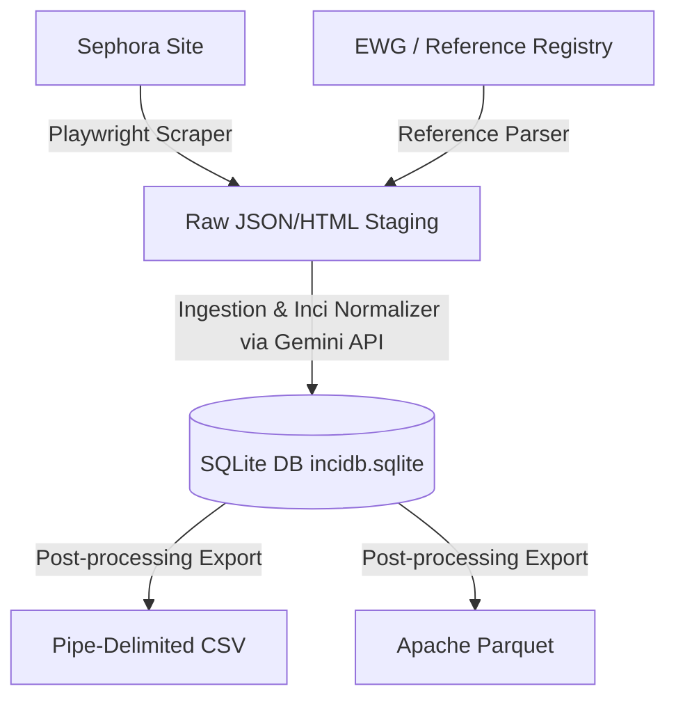

# INCIDB Functional Specification
## Skincare & Cosmetic Ingredients Database (Prototype)

### 1. Overview & Objectives
INCIDB is a structured, relational dataset mapping commercial cosmetic products to their exact chemical ingredient breakdown (INCI names), safety scores, comedogenic ratings, and fungal acne triggers.

The primary objective of the **prototype** is to build a reliable, modular Python pipeline that scrapes data from a single retailer (Sephora) and a single chemical safety database (EWG Skin Deep / CosIng), cleans and normalizes raw ingredient listings using the Gemini API, and packages the result into SQLite, CSV, and Parquet.

### 2. User & Developer Personas
*   **Beauty App Founders:** Need structured, clean ingredient arrays to build ingredient scanner applications.
*   **Data Engineers / Data Scientists:** Need high-quality tabular data in parquet/sqlite formats to feed recommendation algorithms and research models.
*   **Dermatology Researchers:** Require verified safety and hazard classifications for ingredients.

---

### 3. Data Scope & Structure

#### A. Target Retailer: Sephora
The prototype will scrape the following fields per product:
*   **Product Name** (e.g., "Daily Moisturizing Lotion")
*   **Brand Name** (e.g., "CeraVe")
*   **Barcode (UPC/EAN)** (if available)
*   **Category** (e.g., "Cleanser", "Moisturizer")
*   **Retail Price (USD)**
*   **Raw Ingredient Text** (e.g., `"Water, Glycerin, Caprylic/Capric Triglyceride, Niacinamide..."`)

#### B. Target Reference Source: EWG Skin Deep / CosIng
The prototype will cross-reference the extracted ingredients to retrieve:
*   **Standardized INCI Name**
*   **EWG Hazard Score / Safety Score** (scale of 1-10)
*   **Primary Function** (e.g., emollient, preservative, surfactant)
*   **Comedogenic Rating** (0 to 5, if available)
*   **Common Allergen Flag** (boolean)

---

### 4. Functional Requirements

#### FR-1: Modular Ingestion (Scraper Phase)
*   The system must run Playwright to fetch product pages from Sephora.
*   The system must store raw HTML pages or JSON payloads under `data/raw/` to serve as a cache, ensuring we do not hit retailer servers repeatedly during development.

#### FR-2: Ingredient Parsing and LLM Normalization
*   The system must parse comma-separated raw ingredient text strings.
*   The system must use the Gemini API (Google Gen AI SDK) to map brand-specific ingredient aliases to their official International Nomenclature Cosmetic Ingredient (INCI) names (e.g., mapping "Vitamin B3" or "Nicotinamide" to "NIACINAMIDE").
*   The system must resolve and flag common allergens and comedogenic ingredients.

#### FR-3: Relational Ingestion & Persistence
*   The system must insert all normalized brands, products, ingredients, and association maps into a local SQLite database (`incidb.sqlite`) using a clean relational schema.
*   The system must keep track of the position of the ingredient in the list (representing concentration order).

#### FR-4: Export Generation
*   The system must export the relational tables into flat, portable formats:
    *   Pipe-delimited CSV (`|`)
    *   Apache Parquet format

---

### 5. Non-Functional Requirements & Constraints
*   **Reliability:** The scraper must implement random exponential backoffs to prevent immediate blockages.
*   **Cost Control:** LLM calls must use system prompts optimized for low token count and structured outputs to minimize API usage costs.
*   **Portability:** The database must run entirely serverless on SQLite, avoiding the need for a persistent database daemon.
